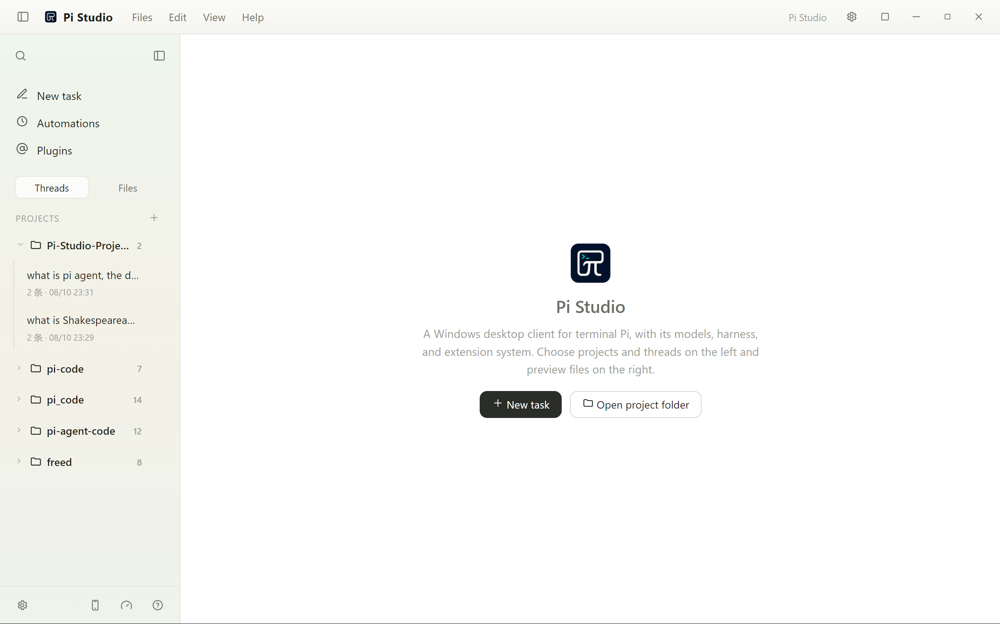
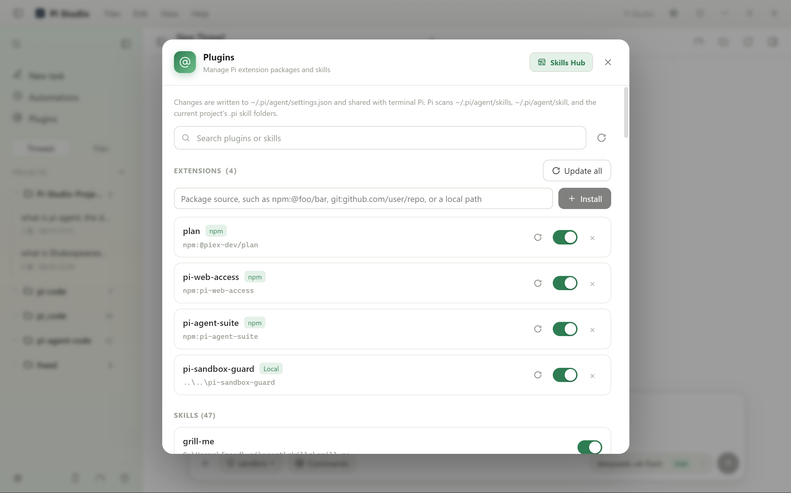
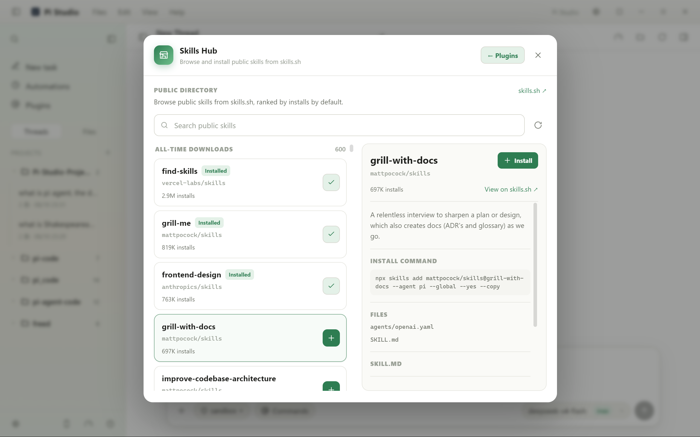
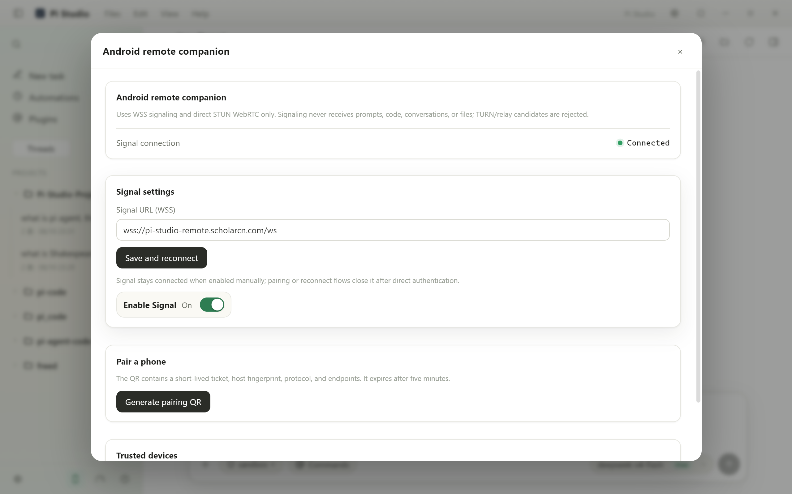

# Pi Studio

[English](README.md) · [简体中文](README.zh-CN.md)

Pi Studio is an independent Electron desktop client for the [Pi coding agent](https://github.com/earendil-works/pi). It brings Pi projects, threads, model configuration, extensions, permission controls, automation, and file previews into one desktop workspace.

> Pi Studio is an independent community project. It is not affiliated with or endorsed by the Pi maintainers.

## Screenshots

The current interface brings the main workspace, plugin manager, public Skills Hub, and Android remote-control settings into one desktop client.

<table>
  <tr>
    <td width="50%"></td>
    <td width="50%"></td>
  </tr>
  <tr>
    <td align="center">Home workspace</td>
    <td align="center">Plugin manager</td>
  </tr>
  <tr>
    <td width="50%"></td>
    <td width="50%"></td>
  </tr>
  <tr>
    <td align="center">Skills Hub</td>
    <td align="center">Android remote-control settings</td>
  </tr>
</table>

## Recent additions

- **Plugin manager** — Search, install, update, enable, disable, and remove Pi extension packages from npm, GitHub, or local paths. The same panel also lists skills discovered in Pi's shared and project directories.
- **Skills Hub** — Browse and search the public [skills.sh](https://skills.sh/) directory, inspect a skill's details and install command, and install it directly into Pi.
- **Android remote companion** — Pair an Android device with a desktop host through a short-lived QR ticket, configure the Signal WSS endpoint, view connection state, and manage trusted devices. The remote transport uses direct WebRTC with STUN discovery; TURN/relay candidates are intentionally rejected. Remote project-relative previews include bounded Excel/CSV table snapshots for Pi-Studio-Remote 0.2.
- **Bilingual UI** — Switch the desktop UI between English and Simplified Chinese.

## Features

- Manage local projects and Pi threads from a desktop sidebar.
- Chat with streaming responses and configurable model and thinking levels.
- Read and preview Markdown, HTML, source code, images, and common office documents.
- Configure providers and models through Pi's shared `models.json` configuration.
- Use Pi extensions and plugins from the shared Pi agent directory.
- Browse and install public skills through the integrated Skills Hub.
- Pair with the Android companion for remote thread viewing and approved controls.
- Run scheduled automations with an explicit sandbox or full-access permission level.
- Keep a versioned Pi/Node runtime embedded in each installer and support app-managed runtime updates.
- Use a permission gate for shell commands, project boundaries, and extension actions.

## Download

Download the latest `Pi-Studio-Setup-<version>.exe` for Windows x64 or `Pi-Studio-<version>-arm64.dmg` for Apple Silicon macOS from GitHub Releases. The installers are currently unsigned, so Windows SmartScreen or macOS Gatekeeper may show a warning.

Each installer contains a native pinned Node.js + Pi runtime. On first launch, Pi Studio verifies and extracts that embedded runtime into the user data directory. Later app updates reuse the extracted runtime without any runtime download.

## Development requirements

- Windows x64 and macOS arm64 are the supported packaging targets.
- Node.js `24.14.0` or newer within the Node 24 major version for development and packaging.
- npm.
- A global Pi coding agent installation is required by the packaging script:

```powershell
npm install -g @earendil-works/pi-coding-agent@0.84.1
```

## Development

```powershell
npm install
npm run typecheck
npm run test:permission
npm run dev
```

Useful commands:

```powershell
npm run build             # Build the Electron application
npm run bundle             # Build the runtime archive embedded by the installer
npm run dist              # Bundle, build, and create the installer
npm run pack              # Create an unpacked directory build
```

Build output is written to `release/`. `npm run dist` creates the Electron installer with the runtime archive embedded inside it; the generated archive in `release/` is retained for QA and does not need to be uploaded separately. The repository pins Pi runtime `0.84.1` in `package.json`, and the packaging script verifies that version before creating the archive. To package from a specific local installation, set `PI_PACKAGE_DIR` to its package directory.

## Configuration and data

Pi Studio shares Pi's agent configuration under `~/.pi/agent`, including model, provider, authentication, and extension settings. The desktop application's own settings are stored in Electron's user data directory.

API keys are user data. Do not commit `auth.json`, `models.json`, session files, screenshots containing keys, or local configuration directories to this repository.

## Permissions and security

Pi can read and write project files and execute tools on the user's behalf. Pi Studio starts new threads in sandbox mode by default. Sandbox automatically runs operations that can be verified as low-risk and explicit, while destructive or recursive deletion, sensitive paths, external code execution, network state changes, and uncertain operations still require confirmation. Full access must be selected explicitly for a thread or automation task. These controls reduce accidental actions but do not replace operating-system isolation or user review.

Do not paste API keys or other secrets into public issues, pull requests, screenshots, or example files. For a security issue, contact the project maintainer privately through GitHub before public disclosure.

## Contributing

Bug reports and pull requests are welcome. Before submitting a change:

1. Keep changes focused and explain user-visible behavior.
2. Run `npm run typecheck`.
3. Run `npm run test:permission` when permission or tool execution code changes.
4. Do not include local data, generated bundles, installers, credentials, or QA browser profiles.

## Third-party software

Pi Studio uses Electron, React, Vite, Pi coding agent, Node.js, and other open-source packages. See [THIRD_PARTY_NOTICES.md](THIRD_PARTY_NOTICES.md) for the component inventory and license references.

## License

The Pi Studio source code is licensed under the [MIT License](LICENSE).

The Pi name, project name, logos, and other trademarks remain the property of their respective owners. The MIT license does not grant trademark rights.
